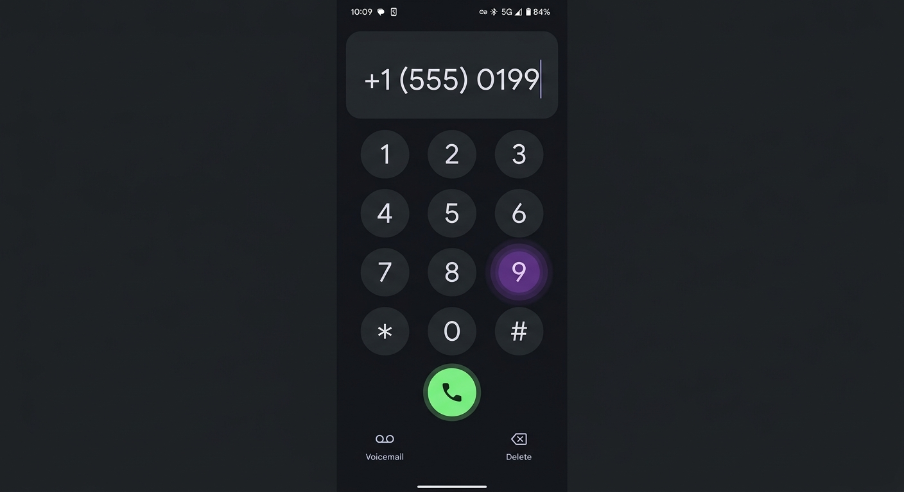
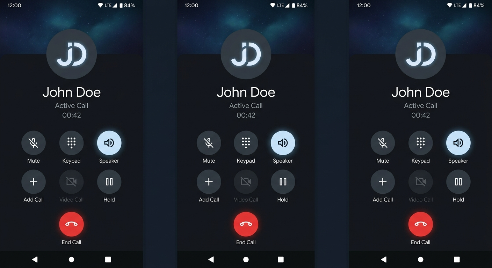
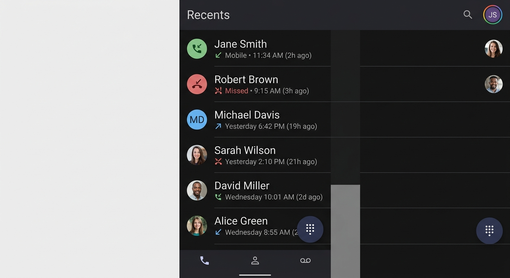

# Secure Dialer 📞 — Pure, Private, & Offline-First Android Dialer


[](LICENSE)
[](https://kotlinlang.org/)
[](https://developer.android.com/jetpack/compose)
[](https://developer.android.com)
[](https://f-droid.org)
[](.github/SECURITY.md)

Welcome to **Secure Dialer**, your trustworthy, lightning-fast, and open-source telephone companion for Android. 

If you are looking for a reliable, modern, and offline-first dialer that can fully replace your phone's pre-installed application, you have found it. Secure Dialer is engineered to provide a secure alternative to commercial caller-ID dialers, stock system apps, and closed-source tools. 

Whether you are looking to replace **Fossify Dialer**, **Simple Dialer**, **Ever Dialer**, **Truecaller**, or standard **Google Dialer**, our application provides a secure, lightweight, and offline experience that respects your communication boundaries.

---

## 📱 Visual Preview

| Dialpad & Contacts | Active Calling | Call History |
| :---: | :---: | :---: |
|  |  |  |

*Note: Screenshots are representative of the Material 3 "Cosmic Slate" theme.*

---

## 🚀 Built 100% with Modern Kotlin & Jetpack Compose

By leveraging Android's latest official technologies, Secure Dialer sets a new standard for modern utility design. This app is written **exclusively in Kotlin** and built **entirely with Jetpack Compose** — there are zero legacy XML layout files or heavy rendering wrappers.

### Why the Kotlin & Jetpack Compose Stack Matters:
* **⚡ Blazing-Fast, Native UI Performance:** Composed views compile directly to native UI widgets. The app launches instantaneously, uses less RAM, and scrolls call histories of any size at a fluid 120Hz.
* **📱 True Edge-to-Edge Adaptive Layouts:** Supports all screen configurations dynamically (foldables, tablets, and phones) with modern system bar insets and elegant dark/light theme shifts.
* **🔋 Minimal Battery Impact:** Pure Kotlin implementation ensures zero background execution leaks or CPU spin-locks, extending your physical device's battery runtime.
* **🧹 Clean & Declarative Codebase:** Easy for security researchers to audit and verify. It features a straightforward single-source-of-truth state engine with `MutableStateFlow` and declarative Material Design 3 (M3) components.

---

## 🌱 Built 100% From Scratch (Independent & Clean)

Unlike many dialers in the Android ecosystem that are mere forks, repackagings, or web-view wrappers of existing legacy codebases, **Secure Dialer is written completely from scratch**. 

* **Clean-Slate Effort:** Every single line of Kotlin and Jetpack Compose code was designed and implemented fresh to conform to modern Material Design 3 guidelines and native Android standards.
* **No Legacy Technical Debt:** By avoiding the baggage of decades-old templates or complex forks, we have kept our footprint remarkably tiny, stable, and easy to audit.
* **Pure Native Integration:** Built natively for modern Android versions using modern concurrency models like Coroutines and StateFlow.

This clean, independent foundation ensures high confidence, peak performance, and absolute auditability.

---

## 🔒 The Zero-Internet Security Promise

Modern commercial dialers frequently upload your contact list, call patterns, and physical location to remote servers under the guise of cloud caller-ID or smart spam blocking. This commercializes your social graph without your knowledge.

**Secure Dialer is built on an unbreakable promise: your communication data is strictly your own business.**

* **No Internet Permission Required:** Secure Dialer does not request the Android Internet Permission (`android.permission.INTERNET`). This simple, auditable architectural constraint makes it **physically impossible** for the app to leak your data.
* **100% Offline Processing:** All operations—from contact searches and call screening to spam blocking and duplicate contact merging—occur entirely on your local CPU.
* **No Telemetry or Ad Frameworks:** You will find no hidden analytics scripts, ad frameworks, crash reporting servers, or tracking engines. 

This level of isolation ensures total confidence for everyday users, privacy advocates, open-source enthusiasts, and code auditors alike.

---

## 🌟 Complete Feature Guide (Full Dialer Replacement)

Secure Dialer provides a comprehensive suite of tools designed to replace your system phone app seamlessly, offering a pristine user interface and native Android-level integration.

### 1. Tactile & Smart Dialpad
* **Clipboard Copy-Paste Integration:** Long-press or tap the dialpad's screen display to open a clean dropdown menu. Instantly copy the typed number, or paste numbers directly from your clipboard (filters out non-dialable symbols, leaving only valid digits, `+`, `*`, and `#`).
* **Interactive Haptic Feedback:** Toggle high-fidelity vibrations for keypress actions.
* **Native DTMF Tones:** Emits hardware-level DTMF tones during active calls to navigate phone menus, IVRs, and dial-in lines effortlessly.
* **Speed Dial Shortcuts:** Assign phone numbers directly to long-press keys `1` through `9` on the dialpad for instant speed-dialing.

### 2. Advanced Call Screen & Multi-Call Support
* **Full Screen Guard Integration:** Hides the in-call interface securely when the device is locked, showing active call screens cleanly and safely.
* **Automatic Soft Keyboard Management:** When you type a number and press the call button, Secure Dialer immediately hides the on-screen keyboard, keeping the focus purely on the calling process.
* **📞 Full Call Waiting & Hold Swapping:** Handle multiple calls simultaneously! If you receive an incoming call during an active call, Secure Dialer shows a custom alert dialog offering:
  * **Answer & Hold:** Puts your current active call on hold and answers the incoming caller.
  * **Decline:** Safely declines the incoming caller without dropping your current conversation.
  * **One-Tap Swap:** Easily swap back and forth between active and held calls.
* **In-Call Controls:** Features custom, high-contrast, interactive toggles for Microphone Mute, Speakerphone, and Bluetooth Audio Routing.

### 3. Comprehensive Contacts Directory & Favorites
* **Interactive Search Filter:** Search your entire contact book in real-time by typing names, phone numbers, or notes.
* **Full CRUD Operations:** Create, edit, and safely delete contacts from inside the app. Deleted contacts are fully sync'd to the system contacts list without any crashes or leftover data.
* **Favorites Tab:** Save your most-called contacts to a quick-access favorites grid for single-tap calling.
* **Quick Action Buttons:** Tap a contact card to instantly place a call or initiate an SMS.

### 4. Smart Call History & Recents
* **Grouped Call Entries:** Group successive calls from the same number into a single line-item with a call counter, keeping your history extremely tidy.
* **Visual Status Indicators:** Color-coded icons for incoming, outgoing, missed, and blocked calls.
* **Quick Recall:** Single-tap callback actions straight from the Recents list.
* **Individual Log Deletion:** Slide or select individual log entries to delete them, or clear the entire history at once.

### 5. Advanced Settings & Customizations
* **Dual-SIM Card Selection:** Set a preferred SIM card for outbound calls (SIM 1, SIM 2, or "Ask Every Time").
* **Local Blocklist Manager:** Add spam phone numbers and robocall patterns to a local database. Powered by Android's native `CallScreeningService`, incoming calls from blocked numbers are rejected silently without disturbing you.
* **Quick SMS Decline Templates:** Custom text messages (e.g., "In a meeting, will call you later") to instantly reject incoming calls with an SMS.
* **Deduplication Utility:** Scan your contacts database to merge duplicate numbers, clean orphaned entries, and clean up formatting issues locally.
* **Centralized Theme Config:** Seamlessly toggle between light and dark modes.

---

## 🔑 Permissions & Why We Need Them

To replace your default system dialer securely, Secure Dialer requests standard system permissions. We believe in complete transparency, so here is exactly why each permission is required:

| Permission | Purpose | Why We Use It |
| :--- | :--- | :--- |
| **`READ_CONTACTS`** | Display Address Book | Required to display your contacts, matching names to phone numbers in the dialer and call history. |
| **`WRITE_CONTACTS`** | Edit & Delete Contacts | Required to let you edit contacts, create new entries, or safely delete them directly from the app interface. |
| **`CALL_PHONE`** | Place Phone Calls | Required to place outgoing calls directly when you tap a contact or press the call button. |
| **`READ_CALL_LOG`** | Display Recents List | Required to show your recent call history, grouped by caller with timestamps. |
| **`WRITE_CALL_LOG`** | Manage Call History | Required to let you clear recents logs or delete single call records. |
| **`MODIFY_AUDIO_SETTINGS`** | Manage Call Audio | Required to toggle between the handset receiver, speakerphone, and Bluetooth headsets during calls. |
| **`USE_FULL_SCREEN_INTENT`** | Show Calling UI | Required to display the full-screen calling screen immediately when an incoming call arrives, even when your device is locked. |
| **`POST_NOTIFICATIONS`** | Show Call Notifications | Required to display running call notification bubbles, missed call banners, and controls. |
| **`SEND_SMS`** | Quick Decline Responses | Required to send quick, templated text messages (e.g., "In a meeting, call you back") when rejecting incoming calls. |
| **`READ_PHONE_STATE`** | Telephony Integration | Required to read cellular carrier info, SIM slots, and detect incoming/outgoing state changes. |

---

## 🏛️ Code Design & Stability Focus (For Auditors)

If you are a developer, security researcher, or software auditor, you will appreciate how Secure Dialer is structured:

* **Zero Memory Leaks:** Standard telephony and audio services use Android's lifecycle-aware callbacks. Callbacks are meticulously registered/unregistered inside view models and managers, eliminating common leak vectors.
* **Lockscreen Privacy Guard:** Uses specific Android Window parameters (`setShowWhenLocked`) dynamically. It only displays active call states when an call is in-flight, immediately dropping lockscreen permissions upon disconnection.
* **Thread-Safe Flow:** Leverages Kotlin Coroutines and `StateFlow` to manage in-memory call states asynchronously, preventing deadlock during high-stress telephony transitions.

---

## 🚀 Getting Started & Build Instructions

### Prerequisites
* **Android Studio** (Koala or newer)
* **JDK 17**
* **Android SDK 24** (Minimum) up to **SDK 36** (Target)

### Build and Install
1. **Clone the repository:**
   ```bash
   git clone https://github.com/secure-phone-apps/secure-dialer.git
   ```
2. **Open the project** inside Android Studio.
3. **Build the Debug APK:**
   ```bash
   ./gradlew assembleDebug
   ```
4. **Deploy** to your Android device.
5. In your Android device settings, navigate to **Apps -> Default Apps**, and set Secure Dialer as your **Default Phone App** and default **Call Screening App** to activate all telephony features.

---

## 🤝 Join Us, Support & Contribute

Secure Dialer is a community-driven, non-commercial initiative. We are building a reliable, privacy-first mobile app catalog, and we invite you to be a part of our journey!

* **⭐ Star the Repository:** If you love our FOSS philosophy, please star this repository on GitHub! It boosts our visibility and helps others find a private phone app alternative.
* **📢 Share the Word:** Share this repository with friends, family, and online privacy forums. Help them reclaim their privacy.
* **💻 Open a Pull Request:** Read our **[Contributing Guidelines](CONTRIBUTING.md)** and review open issues. Whether you want to add localization, improve UI aesthetics, or optimize repository operations, we welcome your contributions.
* **🔍 Audit and Secure:** We encourage safety audits. If you find security concerns, we encourage you to disclose them or open a PR to patch them directly.

Let's build a secure, telemetry-free mobile future together. Thank you for your support, and welcome to our community! 🎉

---

*Secure Dialer is lovingly crafted and maintained by **[Secure Phone Apps](https://github.com/secure-phone-apps)**. Simple, transparent, offline-first mobile apps.*
