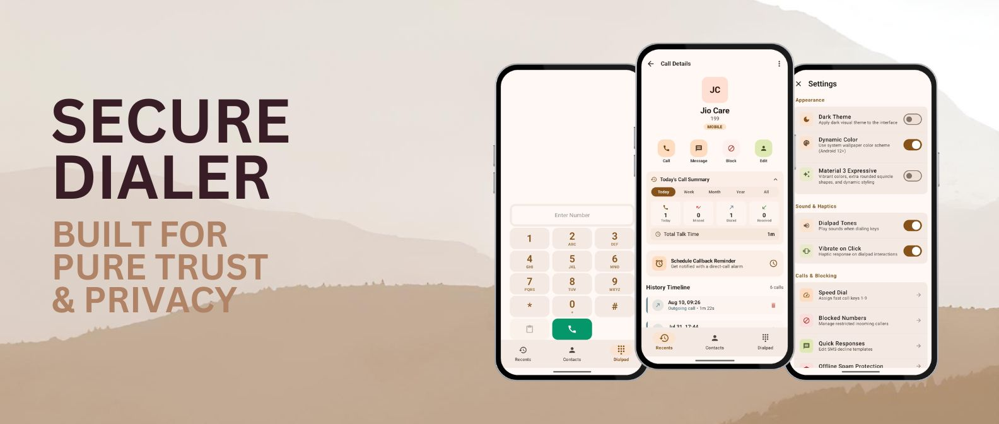
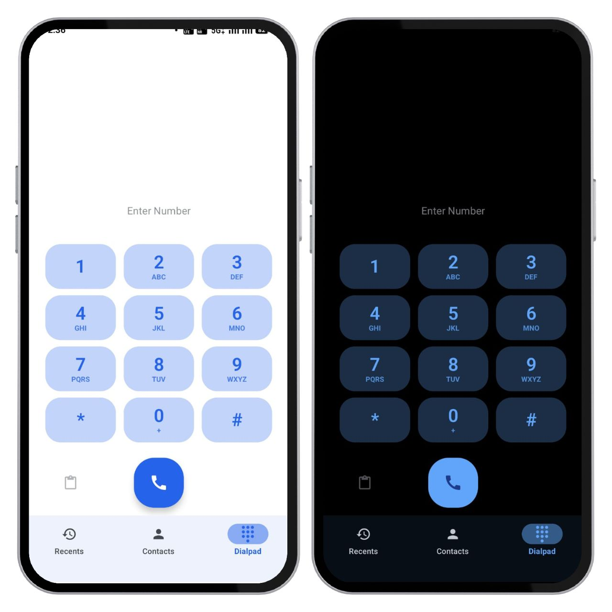
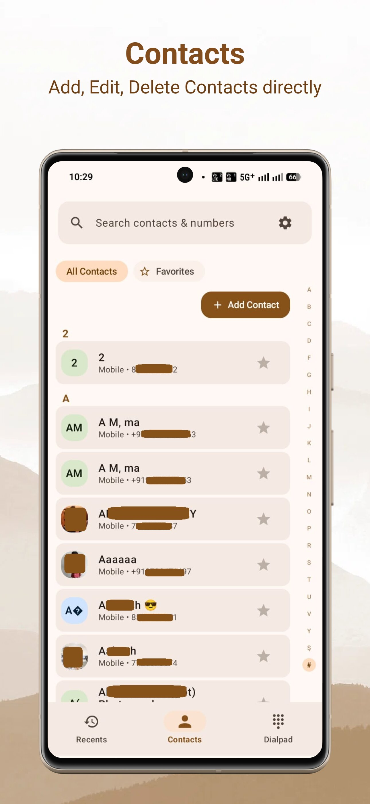
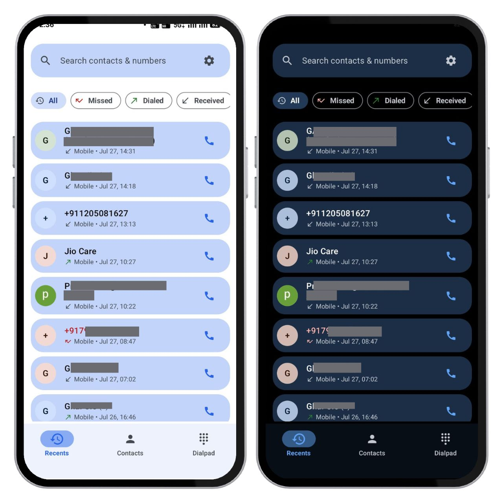

# Secure Dialer 📞 — Pure, Private, & Offline-First Android Dialer App



<p align="center">
  
  
  
  
</p>

Welcome to **Secure Dialer**, your reliable, lightning-fast, and private calling companion for Android. 

Commercial phone apps track your calling habits, upload your personal contacts list to remote clouds, and sell your personal details under the guise of caller ID search. Secure Dialer is built on a simple promise: **your call history, contacts, and phone activity never leave your own device.**

### 🔍 Why People Choose Secure Dialer:
* **True Alternative to Big Tech:** A safe, modern replacement for stock Google Dialer, Samsung Dialer, GrapheneOS Dialer, and commercial apps like Truecaller.
* **Modern Successor to FOSS Classics:** A clean-slate, fully updated successor to Simple Dialer, Fossify Dialer, Ever Dialer, and other older open-source dialers.
* **No Internet, No Leaks:** Does not ask for network permission, meaning zero ads, zero trackers, and zero cloud uploads.

---

## 📱 Visual Preview

| Dialpad | Contacts | Call History |
| :---: | :---: | :---: |
|  |  |  |

---

## 🔒 Our Unbreakable Privacy Shield

Secure Dialer keeps your personal life airtight and completely local on your Android phone:

* **Zero Internet Access:** The app has **no internet permission**, making data theft or remote tracking physically impossible.
* **Encrypted Database:** Your call logs, blocklists, and settings are locked using professional-grade AES-256 encryption (SQLCipher).
* **Hardware-Key Protection:** Your database key is secured inside your device's hardware enclave (Android Keystore System) to guard your data even if your phone is physically compromised.
* **Safe Encrypted Backups:** Export your settings safely with robust password hashing (PBKDF2 with 10,000 iterations) and AEAD encryption (AES-GCM).

---

## ✨ Features At A Glance

Built entirely from scratch using modern **Kotlin** and **Jetpack Compose (Material 3)**.

### 1. Smart Calling & Dialpad
* **Tactile Dialpad:** High-fidelity vibration feedback with real DTMF tones for navigating automated menus.
* **Quick Clipboard:** Long-press to copy/paste numbers instantly (filters out unwanted symbols automatically).
* **Speed Dial:** Hold keys `1` through `9` to dial your top contacts instantly.
* **Dual-SIM Support:** Set a preferred SIM card (SIM 1 or SIM 2) or ask every time you call.
* **Multi-Call & Waiting:** Swap between two calls easily or decline incoming callers without dropping your active conversation.
* **Caller ID (CNAP):** Shows network-provided caller names instantly on screen.

### 2. Built-in Privacy Utilities
* **🎭 Fake Call Scheduler:** Simulate incoming calls after custom delays (5s, 10s, 30s) to exit awkward social situations gracefully.
* **🔔 Flashlight Alerts:** Blink your camera flash for incoming calls in silent mode or noisy environments.
* **👋 Motion Gestures:** Silence incoming calls by turning your phone face-down, or answer calls by raising the phone to your ear.
* **📝 Call Recorder & Notes:** Securely record conversations or jot down private notes inside the call screen, stored safely inside your encrypted local storage.
* **⏰ Callback Reminders:** Get gentle system reminders to call back missed or declined numbers after a set time.
* **📊 Calling Analytics:** View elegant local charts of your call habits, durations, and top contacts.

### 3. Smart Spam Blocklist & Contact Optimization
* **Spam & Robocall Blocker:** Reject robocalls and spam natively and silently using Android’s native `CallScreeningService`.
* **Deduplication Assistant:** Find, merge, and clean up duplicate contacts and formatting issues locally.
* **Flexible Startup Tab:** Choose your default launch screen (Dialpad, Recents, Contacts, Voicemail, or Settings).

---

## 🔑 Transparent Permissions Guide

To work as your default phone application, Secure Dialer requires these standard Android permissions:

| Permission | What It Does | Why We Need It |
| :--- | :--- | :--- |
| **`READ_CONTACTS`** | View Address Book | Displays contact names, photos, and personal notes. |
| **`WRITE_CONTACTS`** | Edit & Add Contacts | Lets you add, edit, or delete contacts inside the app. |
| **`CALL_PHONE`** | Make Outgoing Calls | Directly places calls when you tap a number or contact. |
| **`READ_CALL_LOG`** | Show Recent Calls | Populates your recent call log with exact times and details. |
| **`WRITE_CALL_LOG`** | Manage Call History | Allows clearing your history or deleting single call logs. |
| **`MODIFY_AUDIO_SETTINGS`** | Control Sound Output | Switches seamlessly between earpiece, speaker, and Bluetooth. |
| **`USE_FULL_SCREEN_INTENT`** | Show Ringing Screen | Shows the call screen immediately, even when your phone is locked. |
| **`POST_NOTIFICATIONS`** | Show Active Call Bubbles | Keeps call controls visible in your notification drawer during calls. |
| **`SEND_SMS`** | Quick SMS Responses | Sends instant text responses (e.g., "In a meeting") when declining a call. |
| **`READ_PHONE_STATE`** | Detect Call State | Detects dual SIM cards and changes in active phone lines. |
| **`VIBRATE`** | Haptic Feedback | Powers physical tactile vibrations for keypresses and call events. |

---

## 🛠️ Developer Build & Setup

### Requirements
* Android Studio (Koala or newer)
* JDK 17
* Minimum SDK Support: Android 5.0 (API 24+) up to Android 15 (API 36)

### How to Run
1. **Clone the repository:**
   ```bash
   git clone https://github.com/secure-phone-apps/secure-dialer.git
   ```
2. **Open the project** inside Android Studio.
3. **Assemble the Debug APK:**
   ```bash
   ./gradlew assembleDebug
   ```
4. Install the generated APK on your device, go to **Settings -> Apps -> Default Apps**, and set **Secure Dialer** as your **Default Phone App** and **Call Screening App**.

---

## 📦 Release APK Guide & Architecture Breakdown

When you download a release from our Releases page, you will see several APK variants. Here is exactly which file is for which device:

| APK File Name | Target Device & Architecture |
| :--- | :--- |
| **`secure-dialer-v1.3.0-arm64-v8a.apk`** | **Modern 64-bit Android Phones** (Samsung Galaxy, Google Pixel, OnePlus, Xiaomi, Motorola, etc. manufactured in the last 6+ years). **Recommended for 95% of users.** |
| **`secure-dialer-v1.3.0-armeabi-v7a.apk`** | **Older 32-bit Android Devices** & legacy budget phones. |
| **`secure-dialer-v1.3.0-x86.apk`** | **32-bit Emulators** & Intel-based Android tablets/Chromebooks. |
| **`secure-dialer-v1.3.0-x86_64.apk`** | **64-bit Emulators** & PC environments (Windows Subsystem for Android / ChromeOS). |
| **`secure-dialer-v1.3.0-universal.apk`** | **Universal APK** containing binaries for *all* architectures combined into a single file. |


---

## 🤝 Support & Security

* **🛡️ Security Reporting:** We maintain a zero-tolerance posture toward security flaws. Read our **[Security Policy](SECURITY.md)** to report vulnerabilities safely.
* **📢 Reclaim Privacy:** Tell your friends and family about offline-first calling. Share this repository to spread the word!
* **💻 Contributions:** Want to add translations, fix visual bugs, or improve local database speed? See our **[Contributing Guidelines](CONTRIBUTING.md)** and submit a Pull Request!

---

*Secure Dialer is lovingly crafted by the **[Secure Phone Apps](https://github.com/secure-phone-apps)** team. Clean, simple, offline-first mobile utilities.*

---

## 📄 License

This program is free software: you can redistribute it and/or modify it under the terms of the **GNU General Public License as published by the Free Software Foundation, either version 3 of the License, or (at your option) any later version.** See the [LICENSE](LICENSE) file for more details.


