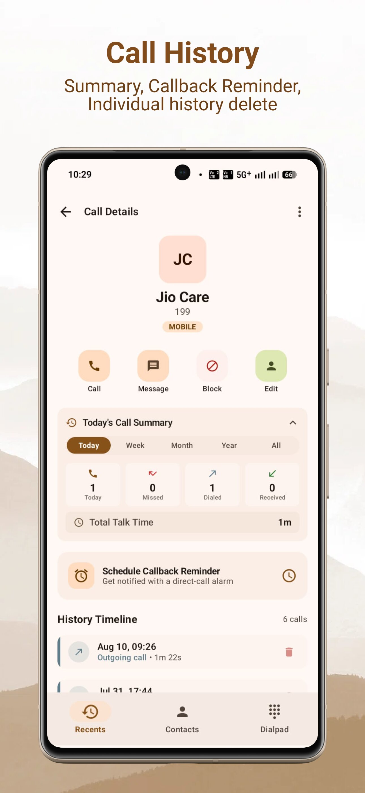
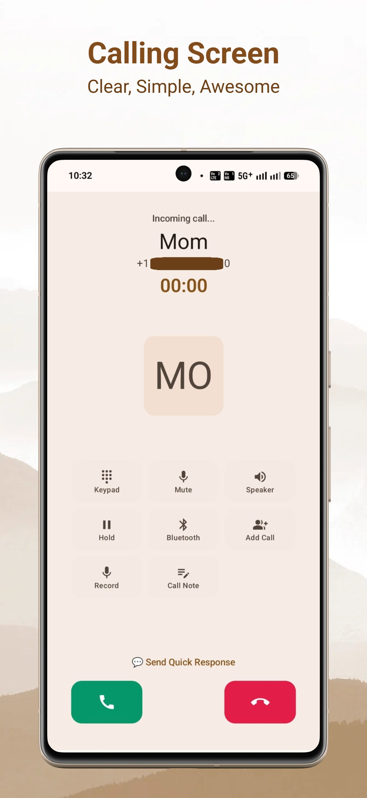
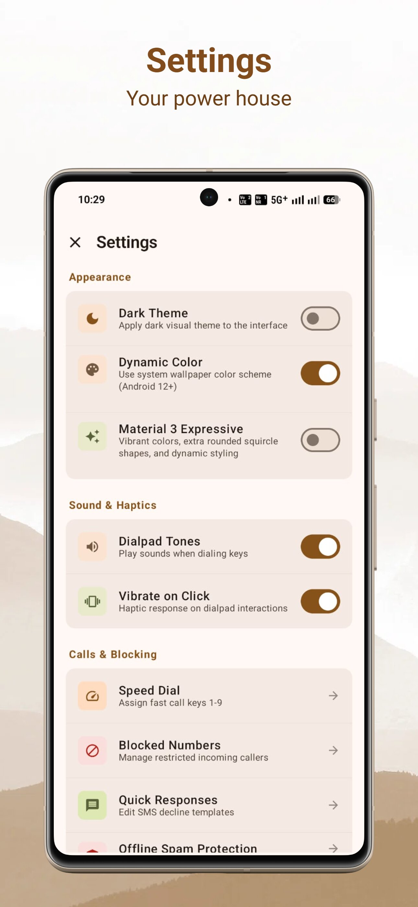

# Secure Dialer 📞 — Pure, Private, & Offline-First Open-Source Android Dialer App


| Dialpad | Contacts | Recents | Call Log | Call Screen | Settings |
| :--- | :---: | :---: | :---: | :---: | :---: |
|  |  |  |  |  |  |
---
<p align="center">
  
  
  
  
</p>

Welcome to **Secure Dialer**, your reliable, lightning-fast, and privacy-hardened calling companion and contacts manager for Android. 

Commercial phone applications track your dialing habits, harvest your contact lists, and upload personal details to remote clouds for data mining. Secure Dialer is built on a transparent, zero-compromise promise: **your call history, contacts database, and phone activity never leave your own physical device.**

---

## 🔍 Why Choose Secure Dialer over Stock Apps?

Whether you are looking for a secure **Google Dialer alternative**, a cleaner **Samsung Dialer replacement**, a privacy-focused successor to **Simple Dialer / Fossify**, or a completely offline, ad-free alternative to **Truecaller**, Secure Dialer is designed to provide professional utility without surveillance.

### 🛡️ Feature Comparison Matrix

| Feature / Security Parameter | **Secure Dialer (FOSS)** | **Google / Samsung Dialer** | **Truecaller / Commercial** | **Simple / Fossify** |
| :--- | :---: | :---: | :---: | :---: |
| **Open Source (GPLv3)** | **Yes (100% Free)** | No (Proprietary) | No (Proprietary) | Yes (FOSS) |
| **Zero Internet Permission** | **Yes (Fully Offline)** | No (Telemetry Uplinks) | No (Collects & Sells Data) | Yes (Fully Offline) |
| **Offline Spam Blocklist** | **Yes (CallScreeningService)**| Yes (Requires Cloud) | Yes (Requires Contact Upload) | No / Limited |
| **AES-256 Database Encryption** | **Yes (SQLCipher)** | No (Stored in Cleartext) | No (Stored on Remote Servers)| No (Stored in Cleartext) |
| **Hardware Key Security** | **Yes (Android Keystore)** | No | No | No |
| **Fake Call & Escape Simulator** | **Yes (High-Fidelity UI)**| No | No | No |
| **vCard/VCF Import & Export** | **Yes (Offline Backup)** | No (Pushes to Google Cloud) | No | Yes (Basic) |

---

## 🔑 Key Features & Architecture

Built natively from the ground up using modern **Kotlin 2.0**, **Jetpack Compose (Material 3)**, and **Room Database**.

### 1. Smart T9 Dialing & Outgoing Calls
* **T9 Search Integration:** Fast search through your contacts directly from the dialpad (similar to Google and Samsung dialers).
* **Tactile Haptic Dialpad:** Rich, responsive vibration feedback with high-fidelity DTMF tones for navigating automated menus.
* **Quick Clipboard Filters:** Long-press to paste numbers instantly; automatically strips out parentheses, spaces, and unwanted symbols.
* **Speed Dial Keys (1-9):** Long-press keys `1` to `9` to dial your critical contacts or trigger custom numbers immediately.
* **Dual-SIM Capability:** Full SIM-selection prompt (SIM 1 or SIM 2) or pre-configured preferred SIM for automatic routing.

### 2. Deep Security & Privacy Shield
* **No Internet Permission:** Literally **zero internet access** declared in the manifest. There is physical exclusion of network capability, meaning absolutely zero ads, zero telemetry, and zero leaks.
* **Encrypted Storage:** All call notes, blacklist configurations, and custom templates are stored locally under strong **AES-256 encryption** using SQLCipher.
* **Hardware-Backed Keystore:** Encryption keys are tied to the device's hardware enclave (Android Keystore System) to guard your logs against physical extraction.
* **Secure Backups:** Export and import encrypted JSON backups protected via PBKDF2 key derivation (10,000 iterations) and AES-GCM authenticated encryption.

### 3. Integrated Utilities (The Rescue/Escape Suite)
* **🎭 Fake Call Simulator:** Trigger high-fidelity, interactive incoming call screens with custom delay timers (5s, 10s, 30s) and multi-call schedules to exit awkward meetings.
* **📝 In-Call Call Recorder & Notes:** Safely record audio conversations locally or jot down private call notes within the active call interface.
* **👋 Hand Motion Gestures:** Turn face-down to silence a call, or lift-to-ear to automatically pick up an incoming caller.
* **⏰ Call Back Reminders:** Instantly set gentle local reminders to call back missed contacts, complete with direct notification buttons.
* **📊 Visual Call Analytics:** Review clean, beautiful Material 3 analytics and charts showing call durations, frequent dialers, and patterns completely offline.

### 4. Smart Spam Filtering & vCard Migrations
* **Robocall Screening:** Natively silence and reject automated spam callers offline using Android's native `CallScreeningService`.
* **vCard / VCF Native Migrations:** Securely import or export your entire contact directory offline via industry-standard `.vcf` formats.
* **De-duplication engine:** Scan your phone local storage to merge, rename, and clean up repeating or duplicate contact entries effortlessly.

---

## 📋 Standard Android Permissions Explained

To act as your **Default Phone App** and provide native calling capabilities, Secure Dialer requests these Android framework permissions:

| Permission | Functionality | Privacy Context |
| :--- | :--- | :--- |
| **`READ_CONTACTS`** | Populate Address Book | Stays 100% on-device to show names, avatars, and contact cards. |
| **`WRITE_CONTACTS`** | Manage Directory | Allows creation, editing, and deleting contacts locally. |
| **`CALL_PHONE`** | Direct Outgoing Calls | Required to execute phone calls when you tap a number or speed dial. |
| **`READ_CALL_LOG`** | Display History | Builds your Recents feed and missed calls history. |
| **`WRITE_CALL_LOG`** | Clear History | Necessary for deleting single entries or wiping the entire call history. |
| **`MODIFY_AUDIO_SETTINGS`**| Audio Routing | Safely shifts audio output to earpiece, speaker, or paired Bluetooth headsets. |
| **`USE_FULL_SCREEN_INTENT`**| Active Caller UI | Essential to overlay the ringing screen when your phone is locked. |
| **`POST_NOTIFICATIONS`**| Ongoing Call Status | Keeps active call bubbles and controls visible in your pull-down drawer. |
| **`SEND_SMS`** | Quick Replies | Sends instant decline-by-text SMS (e.g., "In a meeting") directly when rejecting a call. |
| **`READ_PHONE_STATE`** | Detect SIM & Lines | Used for dual-SIM detection and handling active line states. |
| **`VIBRATE`** | System Haptics | Powers the physical tactile vibration for key presses and dials. |

---

## 🛠️ Build and Developer Setup

### Prerequisites
* **Android Studio** (Koala or newer recommended)
* **JDK 17**
* **Minimum SDK Support:** Android 5.0 (API 24+) up to Android 15 (API 36)

### How to Compile & Run
1. **Clone the repository:**
   ```bash
   git clone https://github.com/secure-phone-apps/secure-dialer.git
   ```
2. **Open the project** in Android Studio.
3. **Assemble the Debug APK:**
   ```bash
   ./gradlew assembleDebug
   ```
4. Install the generated APK on your device, navigate to your Android device's **Settings -> Apps -> Default Apps**, and set **Secure Dialer** as your primary **Default Phone App** and **Call Screening App**.

---

## 📦 Release APK Guide & Architecture Breakdown

When you download a release from our Releases page, you will see several optimized APK variants. Choose the file matching your phone's processor architecture:

| APK File Name | Target Device & Architecture |
| :--- | :--- |
| **`secure-dialer-v1.3.0-arm64-v8a.apk`** | **Modern 64-bit Android Phones** (Samsung Galaxy, Google Pixel, OnePlus, Xiaomi, Motorola, etc. manufactured in the last 6+ years). **Recommended for 95% of users.** |
| **`secure-dialer-v1.3.0-armeabi-v7a.apk`** | **Older 32-bit Android Devices** & legacy budget phones. |
| **`secure-dialer-v1.3.0-x86.apk`** | **32-bit Emulators** & Intel-based Android tablets/Chromebooks. |
| **`secure-dialer-v1.3.0-x86_64.apk`** | **64-bit Emulators** & PC environments (Windows Subsystem for Android / ChromeOS). |
| **`secure-dialer-v1.3.0-universal.apk`** | **Universal APK** containing binaries for *all* architectures combined into a single file. |

---

## 🤝 Support & Security

* **🛡️ Vulnerability Disclosure:** We maintain a zero-tolerance posture toward security flaws. Please consult our **[Security Policy](SECURITY.md)** to report vulnerabilities securely.
* **📢 Reclaim Privacy:** Help spread the word! Tell your friends and family about offline-first communication tools.
* **💻 Contributions:** Want to add translations, resolve UI issues, or optimize database reads? Read our **[Contributing Guidelines](CONTRIBUTING.md)** and submit a Pull Request!

---

*Secure Dialer is lovingly crafted by the **[Secure Phone Apps](https://github.com/secure-phone-apps)** team. Clean, fast, offline-first mobile utilities for Android.*

---

## 📄 License

This program is free software: you can redistribute it and/or modify it under the terms of the **GNU General Public License as published by the Free Software Foundation, either version 3 of the License, or (at your option) any later version.** See the [LICENSE](LICENSE) file for more details.


