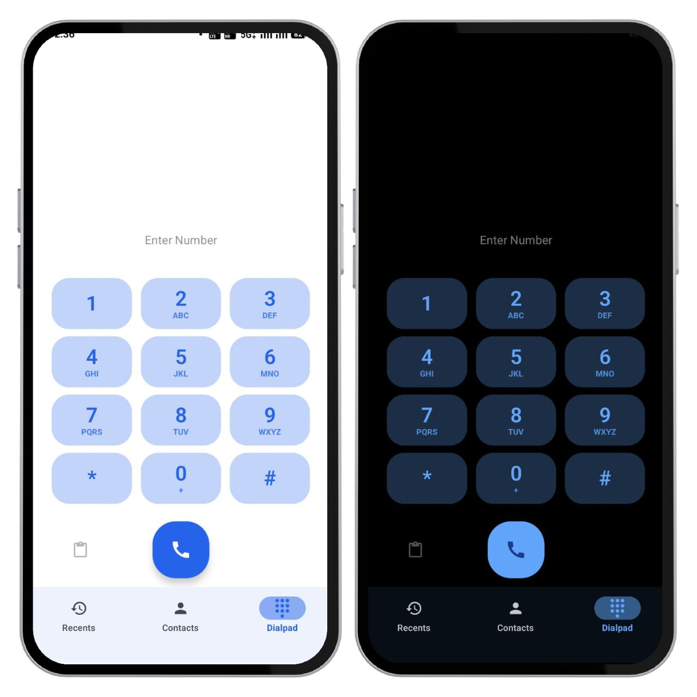
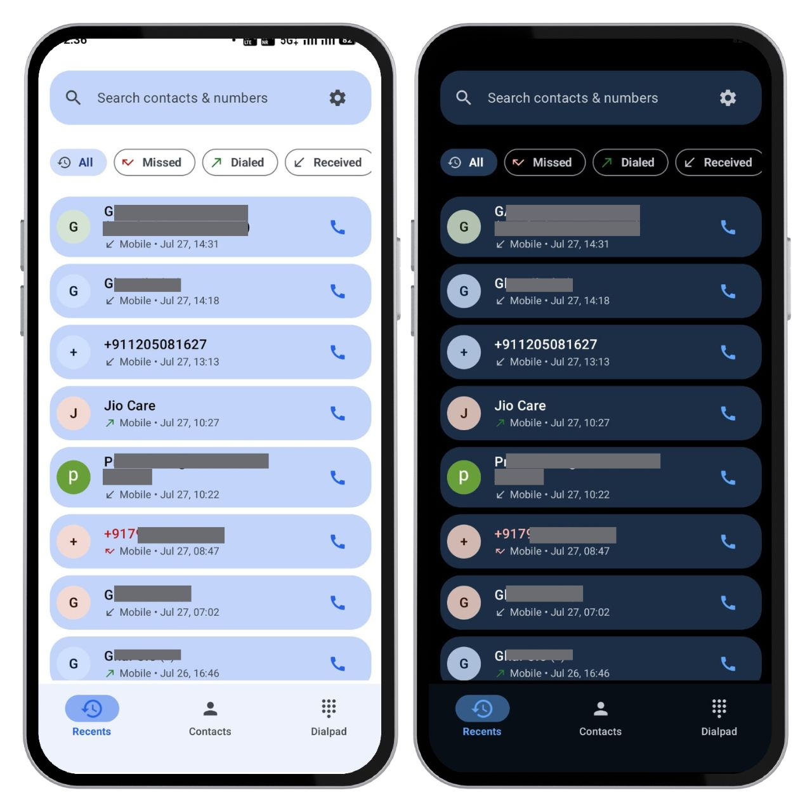
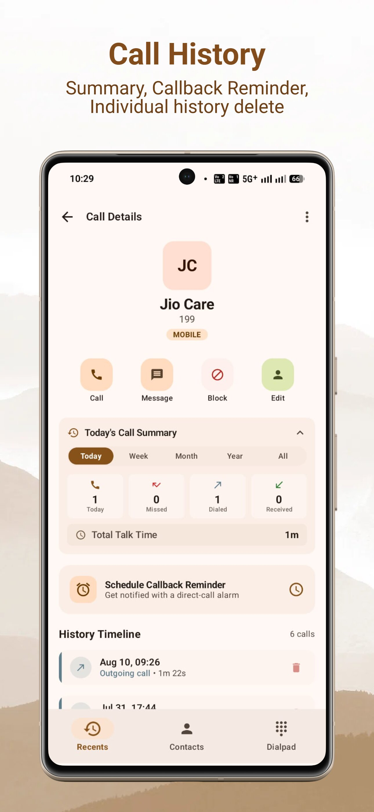

# Secure Dialer — Pure, Private, Lightweight & Offline FOSS Google Dialer Alternative

<p align="center">
  <a href="https://github.com/Secure-Phone-apps/Secure-Dialer/stargazers"></a>
  <a href="https://github.com/Secure-Phone-apps/Secure-Dialer/releases"></a>
  <a href="https://github.com/Secure-Phone-apps/Secure-Dialer/actions/workflows/ci.yml"></a>
  <a href="https://github.com/Secure-Phone-apps/Secure-Dialer/releases"></a>
  <a href="https://developer.android.com/about/versions/nougat/android-7.0"></a>
  <a href="https://kotlinlang.org/"></a>
  <a href="https://developer.android.com/develop/ui/compose"></a>
  <a href="https://github.com/Secure-Phone-apps/Secure-Dialer"></a>
  <a href="https://github.com/Secure-Phone-apps/Secure-Dialer"></a>
  <a href="https://github.com/Secure-Phone-apps/Secure-Dialer/blob/main/LICENSE"></a>
  <a href="https://apps.obtainium.imranr.dev/redirect.html?r=obtainium://add/https://github.com/Secure-Phone-apps/Secure-Dialer"></a>
  <a href="https://github.com/Secure-Phone-apps/Secure-Dialer/discussions"></a>
  <a href="https://github.com/sponsors/Secure-Phone-apps"></a>
</p>

<p align="center">
  <a href="https://apps.obtainium.imranr.dev/redirect.html?r=obtainium://add/https://github.com/Secure-Phone-apps/Secure-Dialer">
    
  </a>
</p>


<p align="center">
  
  
  
</p>
<p align="center">
  
  
  
</p>

Welcome to **Secure Dialer**, an open-source, privacy-first, lightweight, 100% offline Android phone app and FOSS Google Dialer alternative.

Your phone dialer is the single most critical app on your device. Every phone call should remain strictly private between you and the other party. Most pre-installed OEM dialers and commercial caller ID apps track call logs, upload address books to cloud servers, and run background telemetry. Secure Dialer is engineered on a zero-trust model: **zero internet permission, zero ads, zero trackers, and complete on-device data sovereignty.**

```text
┌──────────────────────────────────────────────────────────┐
│                   Android OS Framework                   │
└────────────────────────────┬─────────────────────────────┘
                             │ (Native InCall IPC)
┌────────────────────────────▼─────────────────────────────┐
│             MyInCallService : InCallService              │
└────────────────────────────┬─────────────────────────────┘
                             │
       ┌─────────────────────┼─────────────────────┐
       ▼                     ▼                     ▼
┌──────────────┐     ┌──────────────┐     ┌──────────────────┐
│  Dialer Repo │     │ Room SQLite  │     │ Android KeyStore │
│ (T9 Search)  │     │ (SQLCipher)  │     │ (Hardware Root)  │
└──────────────┘     └──────────────┘     └──────────────────┘
```

---

## The Backstory: Why I Built This

I am not originally from an Android development background, but I was looking for a dialer that is lightweight, fast, privacy-oriented, and visually clean. I kept searching for an open-source dialer that fit everyday calling needs, but couldn't find one that felt completely right.

There are good open-source dialers available like Fossify Dialer, Koler, and others—each serving specific workflows. 

What I set out to build is a dialer that is **fully functional, secure, fast, and lightweight**, while bringing the clean simplicity of **Material 3 and Material 3 Expressive** into daily calling.

The architectural goals:
* **Flawless on modern Android (14, 15, 16)** with expressive dynamic colors and 120Hz frame pacing.
* **Smooth on legacy devices (Android 7 through 13)** keeping older phones useful and fast.
* **Accessible and clear for parents and elders**, clean for minimalists, and packed with practical offline tools for power users.

---

## Quick Comparison: Secure Dialer vs Other Options

| Feature / Security Point | **Secure Dialer (FOSS)** | **Google / Samsung Dialer** | **Truecaller / Commercial** | **Simple / Fossify** |
| :--- | :---: | :---: | :---: | :---: |
| **100% Free & Open Source (GPLv3)** | **Yes** | No (Closed source) | No (Closed source) | Yes |
| **Zero Internet Permission** | **Yes (100% Offline)** | No (Background telemetry) | No (Uploads contacts) | Yes |
| **Local Offline Spam Screening** | **Yes (CallScreeningService)** | Needs Cloud Sync | Needs Cloud & Upload | Limited |
| **On-Device Database Encryption** | **Yes (SQLCipher AES-256)** | Plaintext SQLite | Stored on Cloud Servers | Plaintext SQLite |
| **Hardware Key Protection** | **Yes (Android KeyStore)** | No | No | No |
| **Outgoing Caller ID (CLIR) Masking** | **Yes (Carrier Codes + Bypass)**| Basic | Cloud-dependent | Limited |
| **Biometric App & Recording Vault** | **Yes (BiometricPrompt)** | No | No | No |
| **Local Call Recording Engine** | **Yes (Offline M4A + Scrubber)**| Restricted / Cloud | Uploads / Ads | Basic |
| **Conference & Waiting Call Control** | **Yes (Multi-line Merge)** | Yes | Yes | Limited |
| **Material 3 Expressive UI** | **Yes (Jetpack Compose)** | Stock Material | Cluttered / Ads | Classic M2 / M3 |
| **Works on Older & Newer Phones** | **Yes (API 24 to 36)** | OEM Restricted | Heavy resource usage | Yes |

---

## Core Capabilities & Technical Architecture

Built natively with **Kotlin 2.0**, **Jetpack Compose (Material 3)**, and **Room Database with SQLCipher**:

### 1. Smart T9 Dialpad & Telephony Calls
* **Fast T9 Predictive Search:** Search contacts in milliseconds directly from the dialpad by spelling names or dialing digits.
* **Dual-SIM Management:** Multi-SIM prompt on outgoing calls with customizable default SIM preference per contact or carrier.
* **Outgoing Caller ID (CLIR / Private Calling):** Toggle outgoing number withholding so recipients see Private/Unknown number. Includes presets for GSM (`#31#`), North America (`*67`), UK (`141`), Japan (`1831`), and custom carrier prefixes. Direct shortcut to system SIM hardware settings.
* **Emergency Override Protocol:** Emergency numbers (`911`, `112`, `999`, etc.) automatically bypass CLIR masking, never record audio, and broadcast full subscriber telemetry directly to first responders.
* **Conference & Call Waiting Management:** Merge multiple active calls into a unified conference line (`Call.conference()`), manage split lines, and accept or reject incoming call-waiting requests seamlessly.
* **Tactile Haptic Engine:** Mechanical, micro-calibrated vibration feedback via `VibratorManager` and classic DTMF tones.
* **Quick Speed Dial (Keys 1-9):** Long-press any digit from 1 to 9 to instantly place calls to designated contacts.
* **Smart Clipboard Paste:** Long-press to paste numbers directly; automatically strips dashes, spaces, and formatting characters.

### 2. Privacy, Hardware Security & Screen Shield
* **Zero Internet Access:** The app removes `android.permission.INTERNET` in its manifest. The Android OS physically prevents the app from opening network sockets. No ads, no telemetry, no tracking SDKs.
* **Biometric App Lock:** Protect dialer entry with fingerprint, face unlock, or device PIN/pattern via native `BiometricPrompt` and `KeyguardManager`.
* **Window Screen Shield:** In release builds, `WindowManager.LayoutParams.FLAG_SECURE` blocks unauthorized screenshots, screen recording tools, and recents-overview previews from capturing contact or call history data.
* **Encrypted Database:** Call notes, speed dials, settings, and blocklists are encrypted locally using **AES-256 SQLCipher**.
* **Android KeyStore Protection:** Master database encryption keys are stored inside the device's hardware security module (TEE / StrongBox).
* **Encrypted Backups:** Export and restore configuration archives and blocklists with password protection using **PBKDF2 (10,000 rounds)** and **AES-GCM**.

### 3. Call Recording & Audio Engine
* **Local Call Recorder:** Record important calls directly to local storage without third-party services or cloud dependencies.
* **Multi-Tier Audio Source Fallback:** Adaptive audio engine tries `VOICE_RECOGNITION` $\rightarrow$ `MIC` $\rightarrow$ `VOICE_COMMUNICATION` $\rightarrow$ `DEFAULT` for maximum compatibility across Android versions and OEM skins.
* **3 Audio Profiles:** High Quality (128 kbps), Balanced (64 kbps), and Compact (24 kbps) AAC/M4A encoding.
* **Acoustic Sweet-Spot Tuning:** Automatically balances speaker output to 55% during speakerphone recording to capture clear two-way audio without feedback distortion.
* **Biometric Recording Vault:** Optional fingerprint/PIN lock protecting the call recordings library from unauthorized playback.
* **In-App Scrubber & Player:** Interactive playback scrubber with variable speed control (0.5x, 1.0x, 1.25x, 1.5x, 2.0x) and 5-second jump controls.
* **Scoped Storage Auto-Export:** Optional auto-export to `Downloads/SecureDialer/` for easy backup.
* **Self-Healing Disk Recovery:** Automatically scans and recovers any orphaned `.m4a` files on disk into the database so no recording is ever lost.

### 4. Practical Daily Tools & Ergonomics
* **Dynamic Island / Floating Call Pill:** Compact in-call status indicator when multitasking outside the active call screen, featuring an optional speaker-only mode toggle.
* **Pocket Protection Mode:** Uses the proximity sensor to prevent accidental touch inputs or face-hang-ups while the phone is in a pocket or bag.
* **Fake Call Simulator:** Trigger a realistic incoming call screen with customizable caller name, number, and delay timer (5s, 10s, 30s) for discreet meeting exits.
* **In-Call Notes:** Take private notes during active calls, saved encrypted in local storage with automatic contact linkage.
* **Motion Gestures:** Flip phone face-down to silence incoming ringers, or raise to ear to answer.
* **Flashlight Alerts:** Optional camera LED strobe alerts for incoming calls in dark or noisy environments.
* **Call Back Reminders:** Local alarms to return missed calls without relying on cloud push notification servers.
* **Visual Call Analytics:** Offline statistics and visual summaries of your calling patterns.

### 5. Offline Spam Screening & Contact Management
* **Native Call Screening:** Block spam, robocalls, and hidden numbers offline in under 5ms using Android's native `CallScreeningService`.
* **Spam CSV Import & Export:** Bulk import and export community spam blocklists via standard `.csv` files.
* **Carrier CNAP Presentation:** Displays carrier-provided caller names for incoming unknown calls.
* **vCard / VCF Backup:** Import and export standard `.vcf` contact archives completely offline.
* **Duplicate Contact Cleaner:** Identify and merge duplicate contact numbers with one tap.
* **Interface Personalization:** True `#000000` AMOLED dark theme, customizable avatar shapes (Circular, Rounded Square, Squircle, Hexagon), and customizable tab order and default startup screen.

---

## Android Permissions & Purpose

To function as the **Default Phone App**, Android requires standard telephony permissions. Because Secure Dialer has **zero internet permission**, your data never leaves your device:

| Permission | What It Does | Why It Is Safe |
| :--- | :--- | :--- |
| **`READ_CONTACTS`** | Displays contacts in the dialpad search and contacts tab. | Reads locally on your device; never uploaded. |
| **`WRITE_CONTACTS`** | Adds, edits, or deletes contacts directly in the app. | Updates only your local address book. |
| **`CALL_PHONE`** | Initiates phone calls when tapping a number or speed dial. | Connects directly through your carrier SIM. |
| **`READ_CALL_LOG`** | Shows recent, outgoing, incoming, and missed calls. | Kept strictly on-device. |
| **`WRITE_CALL_LOG`** | Clears call log entries or deletes individual records. | Modifies local logs on your device only. |
| **`RECORD_AUDIO`** | Captures audio for user-initiated local call recordings. | Microphone is accessed strictly on-device; never streamed. |
| **`MODIFY_AUDIO_SETTINGS`**| Switches audio between earpiece, speakerphone, and Bluetooth. | Standard audio routing for voice calls. |
| **`USE_FULL_SCREEN_INTENT`**| Wakes the screen and displays incoming call alerts over lockscreen. | Ensures you do not miss incoming calls. |
| **`POST_NOTIFICATIONS`**| Shows ongoing call controls and missed call badges in status bar. | Local system notifications only. |
| **`SYSTEM_ALERT_WINDOW`**| Renders the minimized in-call pill / Dynamic Island overlay. | Allows floating call controls while using other apps. |
| **`WAKE_LOCK`** | Manages the proximity sensor to turn screen off near your ear. | Prevents accidental face touches during calls. |
| **`DISABLE_KEYGUARD`** | Enables answering incoming calls over the lockscreen. | Answers calls without unlocking the keyguard first. |
| **`VIBRATE`** | Provides tactile feedback for keypad taps and call actions. | Hardware haptics only. |

*Note on SMS: Secure Dialer does not request the dangerous `SEND_SMS` permission. Quick decline text messages are handed off through Android's standard system messaging app chooser.*

---

## Important Guidelines & Disclaimers

1. **Call Recording Legal Notice:** Laws regarding the legality of recording telephone conversations vary significantly by country, state, and jurisdiction (including one-party vs. two-party/all-party consent requirements). You are solely responsible for complying with all applicable laws in your jurisdiction before enabling or utilizing the recording feature.
2. **Emergency Calling (911 / 112 / 999):** Emergency service calls are given absolute priority by the Android Telecom subsystem. Secure Dialer automatically strips any Caller ID withholding prefixes (`CLIR`) on emergency calls and passes them unmodified to the baseband radio to guarantee that location and identity telemetry reach first responders.
3. **Zero-Knowledge Encryption Advisory:** On-device database encryption (SQLCipher AES-256) and encrypted `.enc` backups utilize industry-standard cryptographic algorithms without backdoors or recovery escrow. If you set and forget a backup password, the data cannot be decrypted or recovered.
4. **Carrier CLIR Limitations:** While Secure Dialer prepends standard 3GPP carrier MMI prefixes (`#31#`, `*67`, etc.) to suppress outgoing caller ID, your mobile network operator or international roaming agreements may restrict or override number withholding on certain tariff plans.

---

## Download & Installation

### Option 1: Automatic Updates via Obtainium (Recommended)
If you use [Obtainium](https://github.com/ImranR98/Obtainium), you can receive automatic update notifications directly from our GitHub Releases:

<p align="center">
  <a href="https://apps.obtainium.imranr.dev/redirect.html?r=obtainium://add/https://github.com/Secure-Phone-apps/Secure-Dialer">
    
  </a>
</p>

1. Install Obtainium on your Android phone.
2. Tap **Add App** and paste our repository URL: `https://github.com/Secure-Phone-apps/Secure-Dialer`.
3. Tap **Add** and Obtainium will automatically match the right APK for your device architecture and keep you updated.

### Option 2: Direct APK Download from GitHub Releases
Download signed release APKs directly from our **[GitHub Releases Page](https://github.com/Secure-Phone-apps/Secure-Dialer/releases)**:

| APK File Name | Which One Should You Download? |
| :--- | :--- |
| **`secure-dialer-v1.6.0-arm64-v8a.apk`** | **Most modern Android phones** (Pixel, Samsung Galaxy, OnePlus, Xiaomi, Motorola from the last 6+ years). **Choose this if unsure.** |
| **`secure-dialer-v1.6.0-armeabi-v7a.apk`** | **Older 32-bit Android phones** and entry-level legacy hardware. |
| **`secure-dialer-v1.6.0-x86_64.apk`** | **64-bit Emulators**, ChromeOS, or Android-x86 PC setups. |
| **`secure-dialer-v1.6.0-universal.apk`** | **Universal build** that runs on any supported Android architecture. |

---

## Building from Source (For Developers)

To inspect the code, run tests, or compile your own APK:

```bash
# 1. Clone the repository
git clone https://github.com/Secure-Phone-apps/Secure-Dialer.git
cd Secure-Dialer

# 2. Run unit and Robolectric tests
gradle :app:testDebugUnitTest

# 3. Build the debug APK
gradle :app:assembleDebug
```

Output APK will be generated at: `app/build/outputs/apk/debug/`

---

## Community, Feedback & Support

We are continuously refining Secure Dialer to ensure it remains reliable, clean, and secure.

* **[GitHub Discussions](https://github.com/Secure-Phone-apps/Secure-Dialer/discussions):** Share suggestions, ask questions, or report compatibility on your device model.
* **[GitHub Issues](https://github.com/Secure-Phone-apps/Secure-Dialer/issues):** Report bugs or edge cases with your device model and Android version.
* **[Project Wiki](wiki/Home.md):** In-depth technical documentation on encryption, permissions, and custom ROM setups (GrapheneOS, CalyxOS, LineageOS).
* **[Sponsor on GitHub Sponsors](https://github.com/sponsors/Secure-Phone-apps):** Support development, maintenance, and testing hardware acquisition.

---

## License

Secure Dialer is free software licensed under the **GNU General Public License v3.0 (GPLv3)**. You are free to inspect, audit, modify, and build it from source. See the [LICENSE](LICENSE) file for complete terms.
